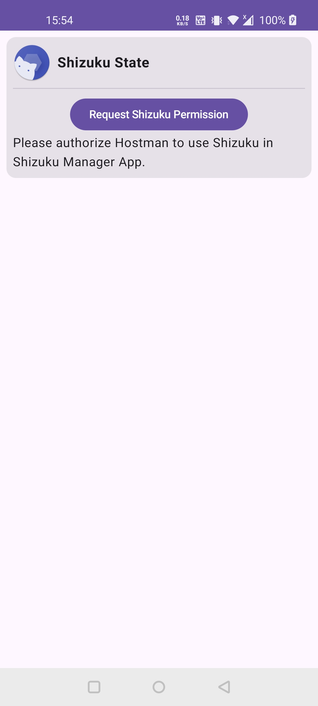
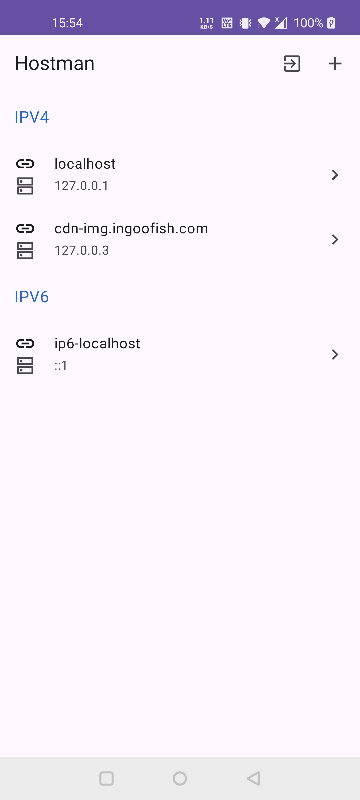
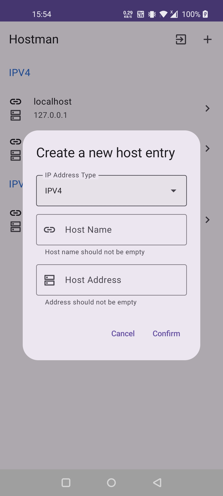
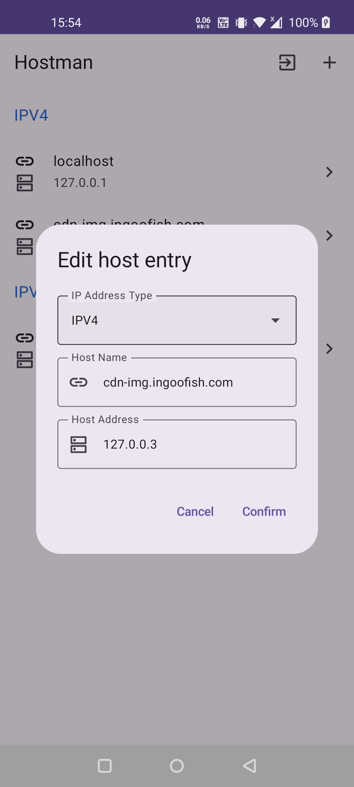
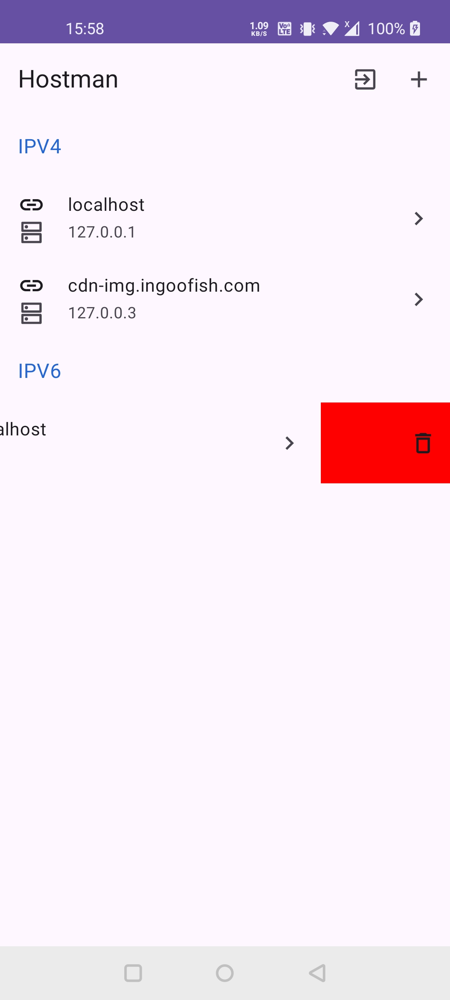

<h2>

Hostman
</h2>
A simple Android app that can preview/edit /etc/hosts file in a GUI manner.
Requires [Shizuku](https://github.com/RikkaApps/Shizuku/) in root mode.

Tested on OnePlus 8 and Xiaomi MIX2S, both are running Android 10.

Note: You may also need to mount the /system folder with r/w permission in your
favourite approach in advance.

## Screenshots

### Request Permission:

### Homepage:

### Creating Host Entry

### Editing Host Entry

### Deleting Host Entry

